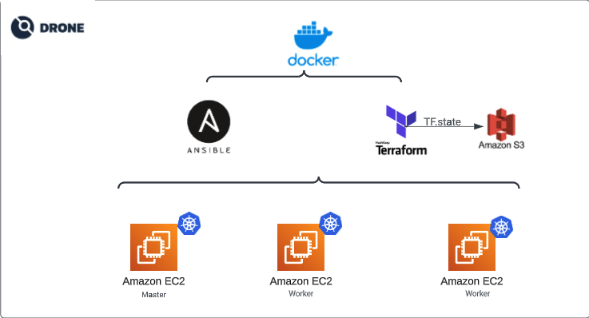

# projeto-devops

## Arquitetura
________________

   

 3 instâncias de EC2 - AWS (1 Master, 2 Workers) configuradas por Terraform, com security group e um keypair. O estado da infrastrutura (TF.state) é armazenado em um bucket S3, 
 para que possa ser centralizado e compartilhado com os demais usuários da infra.

A instalação e configuração do cluster é definida no site.yml e executada pelo Ansible.

A imagem docker é construida para ser executada pelo Drone CI, em sua pipeline ele será responsavel por rodar todas as etapas de configurações definidas executando o Terraform e Ansible, como resultado teremos um cluster Kubernetes construido 
de forma totalmente automatizada

